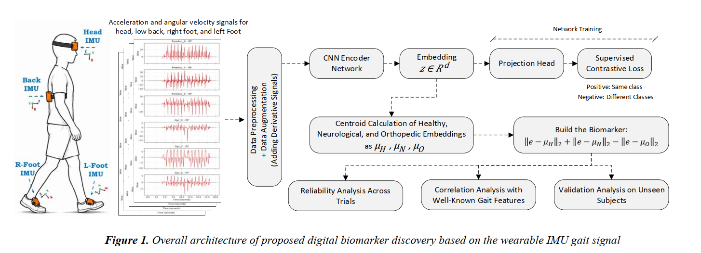
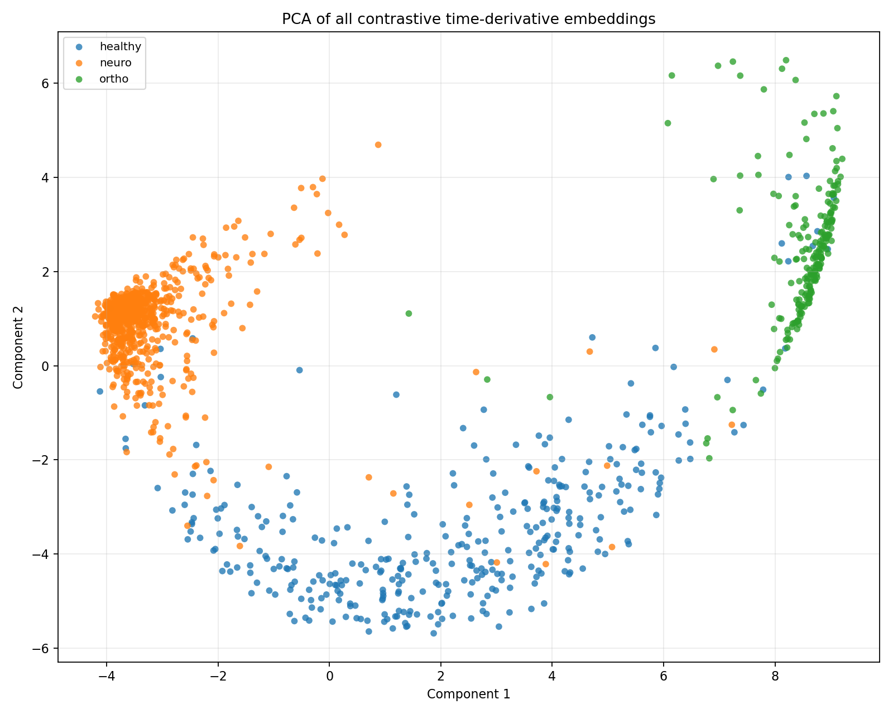

# Embedding-Distance Gait Biomarker (EDGB)

EDGB is a deep representation learning framework that transforms multi-sensor wearable inertial measurement unit (IMU) signals into a compact digital biomarker for quantitative gait assessment.

Overview:

Gait impairments are common across neurological and orthopedic disorders and are traditionally assessed using handcrafted spatiotemporal features such as stride time and gait cadence. This repository introduces the Embedding-Distance Gait Biomarker (EDGB), a novel representation-learning approach that:

learns discriminative gait representations using supervised contrastive learning;
integrates information from multiple body-worn IMU sensors;
constructs a scalar biomarker based on distances to class-specific embedding prototypes;
enables quantitative assessment of healthy, neurological, and orthopedic gait patterns.

**Framework**:

  

The proposed framework consists of:

Multi-sensor IMU preprocessing and augmentation;
1D CNN encoder for representation learning;
Supervised contrastive training;
Prototype estimation in the embedding space;
Construction of the Embedding-Distance Gait Biomarker (EDGB);
Statistical and clinical validation.

**Main Results**
Macro AUC: 92.85%
Effect size (η²): 0.71
ICC(2,1): 0.82
Superior discrimination compared with conventional gait measures.

  

Repository Structure
├── data/                # Dataset loaders
├── models/              # CNN encoder and projection head
├── training/            # Supervised contrastive training
├── biomarker/           # EDGB construction
├── evaluation/          # Statistical analysis and metrics
├── figures/             # Paper figures
├── notebooks/           # Example notebooks
└── README.md

**Dataset**
Experiments are conducted on the publicly available Voisard Gait Dataset:
Voisard et al., A Dataset of Clinical Gait Signals with Wearable Sensors from Healthy, Neurological, and Orthopedic Cohorts, Scientific Data, 2025.
Repository:
https://github.com/CyrilVoisard/dataset_gait_1
Dataset:
https://doi.org/10.6084/m9.figshare.28806086

Installation
git clone https://github.com/<username>/EDGB.git
cd EDGB
pip install -r requirements.txt
Training
python train.py
Evaluation
python evaluate.py
Citation

If you find this repository useful, please cite:

@article{mohtavipour2026edgb,
  title={Supervised Contrastive Learning-Based Digital Biomarker Discovery for Wearable IMU Gait Signals},
  author={Mohtavipour, Seyed Mehdi},
  journal={Preprint},
  year={2026}
}
Contact

Seyed Mehdi Mohtavipour
PhD Researcher – AI for Movement Disorders
Radboud University Medical Center, The Netherlands

Email: mahyar.m1990@gmail.com

License

This project is released under the MIT License.
